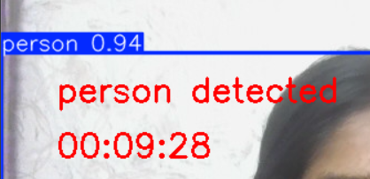
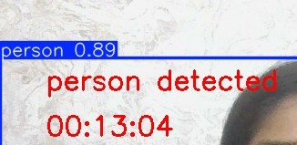

# AI Security Camera using YOLOv8

## Description

An AI-powered security camera developed using Python, OpenCV, and YOLOv8. The system continuously monitors a webcam feed and automatically detects people in real time. When a person is detected, the application displays an alert message and captures a snapshot automatically.

## Features

- Real-time webcam monitoring
- Person detection using YOLOv8
- Automatic snapshot capture
- Bounding box visualization
- Live alert display
- Real-time computer vision processing

## Technologies Used

- Python
- OpenCV
- YOLOv8 (Ultralytics)

## Screenshots

### Person Detection



### Saved Snapshot



## How to Run

1. Install dependencies

```bash
pip install ultralytics opencv-python
```

2. Run the program

```bash
python ai_security_camera.py
```

## Project Structure

```text
ai-security-camera
│
├── ai_security_camera.py
├── person_detected.png
├── person_1.jpg
└── README.md
```

## Author

Fasna Shabeer
